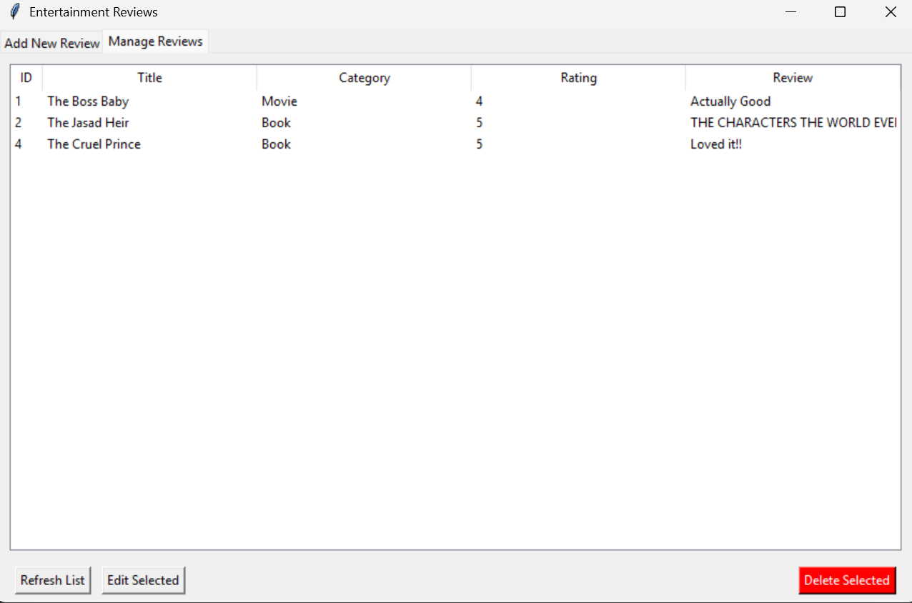

# Entertainment Review Tracker

A desktop application built with Tkinter that allows users to track, review, rate, and manage their entertainment activities such as books, movies, and documentaries. The application uses SQLite as its database to store and manage reviews and ratings.

## Features
- Tabs for easy access.
- Add new entertainment entries (books, movies, documentaries)
- View all entries and reviews
- Update existing reviews and ratings
- Delete entries
- Persistent storage with SQLite database

## Technologies Used

- Python 3.x
- Tkinter for GUI
- SQLite for database management

## Screenshots





## Getting Started


### Prerequisites

- Python 3.x installed on your system

### Installation

1. Clone or download this repository
2. Ensure Python is installed and added to your PATH

### Running the Application

```bash
python main.py
```

**Author:** Arhama B
